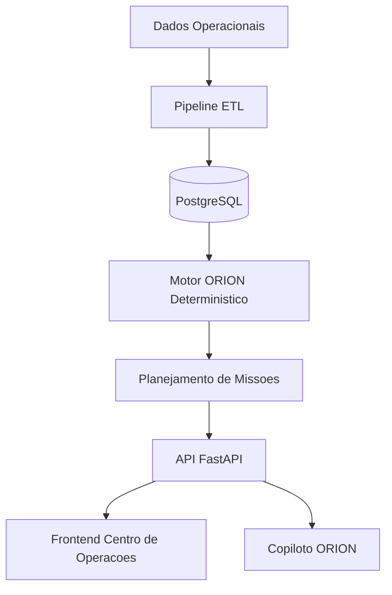

# Motiva ORION

Operational Roadside Intelligence & Optimization Network

Plataforma de inteligencia operacional para gestao preditiva da vegetacao rodoviaria da CCR Motiva, com foco em decisao, priorizacao e execucao.

Status: MVP operacional concluido (Sprints 1 a 5)  
Versao: 0.3.0  
Licenca: Proprietary  

## Resumo Executivo

O ORION consolida dados operacionais e geoespaciais, calcula risco de forma deterministica, prioriza trechos, gera missoes e disponibiliza explicacoes executivas para apoiar gestores e equipes de campo.

Problema resolvido:
- priorizacao subjetiva
- resposta reativa
- custo logistico elevado
- baixa previsibilidade de conformidade contratual

Resultado esperado:
- decisao mais rapida e padronizada
- menor custo operacional
- maior controle de risco e conformidade

## Arquitetura



## Stack

Frontend:
- React
- TypeScript
- Vite
- TailwindCSS
- Leaflet

Backend:
- FastAPI
- SQLAlchemy
- PostgreSQL

ETL e geodados:
- Pandas
- GeoPandas
- OpenPyXL
- Shapely
- FastKML

## Funcionalidades Principais

1. Data Foundation:
- importacao de CSV, XLSX, KML e KMZ
- normalizacao para modelo unico

2. Motor ORION:
- IRO (0 a 100) deterministico
- classificacao: Normal, Atencao, Critico
- recomendacao por trecho (acao, prazo, metodo)

3. Planejamento Operacional:
- agrupamento de trechos
- missao com prioridade, equipe, tempo e custo
- geracao de plano semanal

4. Centro de Operacoes:
- painel executivo
- simulador de cenarios
- mapa operacional
- ranking e detalhe de trecho
- copiloto explicativo

5. Conformidade e relatorios:
- painel de conformidade
- relatorios PDF operacional, executivo e conformidade

## Regras de Negocio

IRO:
- escala de 0 a 100
- pesos configuraveis para vegetacao, dias sem manutencao, chuva, criticidade operacional e risco contratual

Criticidade:
- 0-30: Normal
- 31-60: Atencao
- 61-100: Critico

Governanca de IA:
- IA nao calcula IRO, risco, prioridade ou missao
- IA apenas interpreta resultados calculados no backend

## Modelo de Dados (Essencial)

Trecho:
- id, km_inicio, km_fim, sentido, lado, tipo_area, status
- latitude, longitude, geom
- nivel_rocada, dias_sem_manutencao, chuva_acumulada_mm
- criticidade_operacional, risco_contratual, iro, classificacao
- recomendacao_acao, recomendacao_prazo_dias, recomendacao_metodo

Missao:
- id, codigo, prioridade, equipe, tempo_estimado_h, custo_estimado
- economia_logistica_estimada, trecho_ids, plano_semanal_ref

Indicador:
- total_trechos, trechos_criticos, indice_medio_iro, economia_potencial

Usuario:
- nome, email, perfil, ativo

## Endpoints Principais

Base: `http://127.0.0.1:8000`

- `GET /health`
- `POST /api/v1/auth/login`
- `POST /api/v1/auth/login-json`
- `GET /api/v1/auth/me`
- `POST /api/v1/bootstrap`
- `POST /api/v1/imports/gestao-verde`
- `GET /api/v1/trechos`
- `GET /api/v1/trechos/criticos`
- `GET /api/v1/trechos/{id}`
- `GET /api/v1/indicadores`
- `GET /api/v1/missoes`
- `POST /api/v1/plano-semanal/gerar`
- `GET /api/v1/conformidade`
- `GET /api/v1/dashboard`
- `POST /api/v1/copilot/perguntar`
- `GET /api/v1/relatorios/{tipo}`

## Execucao Local

Inicializacao rapida (Windows):
1. `setup-local.cmd`
2. `start-local.cmd`

Backend manual:
```bash
cd backend
python -m venv .venv
.venv\Scripts\activate
pip install -r requirements.txt
set PYTHONPATH=.
.venv\Scripts\python.exe scripts\run_sql_migrations.py
.venv\Scripts\python.exe scripts\seed_db.py
uvicorn app.main:app --reload
```

Frontend manual:
```bash
cd frontend
npm install
npm run dev
```

## Credenciais Locais

- `admin@motiva-orion.local` / `orion123`
- `gestor@motiva-orion.local` / `orion123`
- `operador@motiva-orion.local` / `orion123`

Observacao:
- no ambiente local atual, o fallback de autenticacao por `auth_default_password` pode estar ativo.

## Observabilidade e Seguranca

Seguranca:
- autenticacao JWT
- autorizacao por perfil (`admin`, `gestor`, `coordenador`, `operador`)

Observabilidade:
- `request_id` por requisicao
- logs estruturados
- metricas Prometheus:
  - `orion_http_requests_total`
  - `orion_http_request_latency_seconds`
  - `orion_http_errors_total`

## Estrutura do Projeto

```text
backend/
  app/
    api/
    application/
    core/
    database/
    domain/
    engine/
    etl/
    repositories/
  data/
  database/
    migrations/
  scripts/
frontend/
  src/
```

## Limitacoes Atuais

- integracoes satelitais (Sentinel/Copernicus) ainda nao ativadas em producao
- OpenRouteService ainda em preparacao arquitetural

## Referencias Internas

- Plano de sprints: `docs/sprints/SPRINTS.md`
- Backlog Sprint 1: `docs/sprints/sprint-01-backlog.md`
