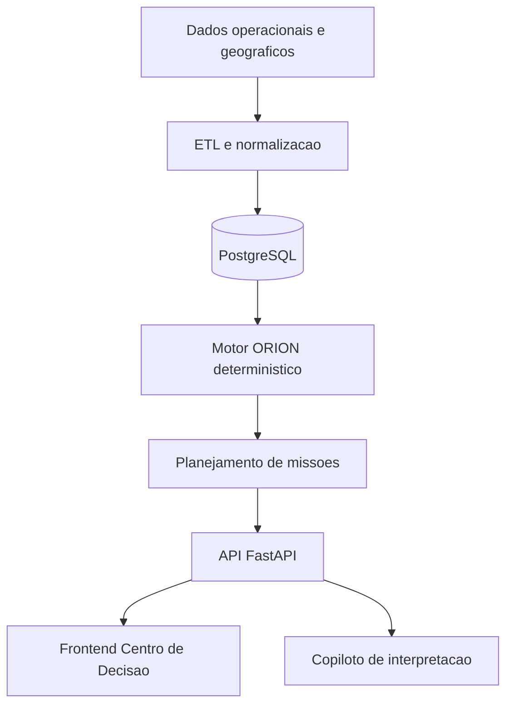

# Motiva ORION

Operational Roadside Intelligence & Optimization Network.

Plataforma corporativa de inteligencia operacional para gestao preditiva da vegetacao rodoviaria, com foco em decisao, conformidade e eficiencia de campo.

Status: Em evolucao controlada  
Versao: 0.3.1  
Licenca: Proprietary

## Visao de Produto

O Motiva ORION transforma dados operacionais em decisoes acionaveis para concessionarias rodoviarias. O sistema consolida fontes heterogeneas, calcula risco de forma deterministica, prioriza intervencoes e gera plano semanal de missao com impacto estimado.

Objetivos operacionais:
- reduzir risco viario por atraso de manutencao de vegetacao
- reduzir custo logistico e deslocamentos
- melhorar previsibilidade contratual
- padronizar criterio de decisao entre equipes e turnos

## Escopo Atual

Capacidades implementadas:
- pipeline ETL para CSV, XLSX, KML e KMZ
- normalizacao e persistencia em banco relacional
- Motor ORION com IRO (0-100) e classificacao operacional
- planejamento automatico de missoes por criticidade/proximidade
- API REST com autenticacao JWT e controle por perfil
- painel web com centro executivo, mapa, ranking e simulador
- copiloto para explicacao textual dos resultados calculados
- relatorios PDF (operacional, executivo e conformidade)

Fora do escopo atual:
- calculo de risco por IA
- planejamento de missao por IA
- processamento satelital em producao

## Arquitetura



## Stack Tecnica

Frontend:
- React
- TypeScript
- Vite
- TailwindCSS
- Leaflet

Backend:
- FastAPI
- SQLAlchemy
- PostgreSQL

Dados e ETL:
- Pandas
- GeoPandas
- OpenPyXL
- Shapely
- FastKML

## Regras de Negocio

IRO (Indice de Risco Operacional):
- faixa: 0 a 100
- fatores: vegetacao, dias sem manutencao, chuva, criticidade operacional, risco contratual
- pesos configuraveis via configuracao de backend

Classificacao:
- 0-30: Normal
- 31-60: Atencao
- 61-100: Critico

Governanca de IA:
- IA nao calcula risco, score, prioridade ou missao
- IA apenas interpreta resultados do backend

## API Principal

Base local: `http://127.0.0.1:8000`

- `GET /health`
- `POST /api/v1/auth/login`
- `GET /api/v1/auth/me`
- `POST /api/v1/bootstrap`
- `POST /api/v1/imports/gestao-verde`
- `GET /api/v1/trechos`
- `GET /api/v1/trechos/criticos`
- `GET /api/v1/trechos/{id}`
- `GET /api/v1/indicadores`
- `GET /api/v1/missoes`
- `POST /api/v1/plano-semanal/gerar`
- `GET /api/v1/conformidade`
- `GET /api/v1/dashboard`
- `POST /api/v1/copilot/perguntar`
- `GET /api/v1/relatorios/{tipo}`

## Execucao Local

Inicializacao rapida (Windows):
1. `setup-local.cmd`
2. `start-local.cmd`

Backend manual:
```bash
cd backend
python -m venv .venv
.venv\Scripts\activate
pip install -r requirements.txt
set PYTHONPATH=.
.venv\Scripts\python.exe scripts\run_sql_migrations.py
.venv\Scripts\python.exe scripts\seed_db.py
uvicorn app.main:app --reload
```

Frontend manual:
```bash
cd frontend
npm install
npm run dev
```

Checklist de demonstracao:
```powershell
powershell -ExecutionPolicy Bypass -File .\scripts\demo-smoke.ps1
```

## Credenciais Locais de Desenvolvimento

- `admin@motiva-orion.local` / `orion123`
- `gestor@motiva-orion.local` / `orion123`
- `operador@motiva-orion.local` / `orion123`

Observacao:
- credenciais acima sao exclusivas para ambiente local de desenvolvimento

## Seguranca e Observabilidade

Seguranca:
- autenticacao JWT
- autorizacao por perfil (`admin`, `gestor`, `coordenador`, `operador`)
- trilha de separacao entre calculo deterministico e camada de IA

Observabilidade:
- `request_id` por requisicao
- logs estruturados
- metricas Prometheus:
  - `orion_http_requests_total`
  - `orion_http_request_latency_seconds`
  - `orion_http_errors_total`

## Estrutura do Repositorio

```text
backend/
  app/
    api/
    application/
    core/
    database/
    domain/
    engine/
    etl/
    repositories/
  data/
  database/migrations/
  scripts/
frontend/
  src/
docs/
scripts/
```

## Roadmap Tecnico

Proximas entregas recomendadas:
- ativacao controlada de integracao satelital
- enriquecimento logistico com OpenRouteService em modo produtivo
- hardening de autenticao para ambiente corporativo
- cobertura adicional de testes de integracao

## Referencias

- `docs/sprints/SPRINTS.md`
- `docs/sprints/sprint-01-backlog.md`
