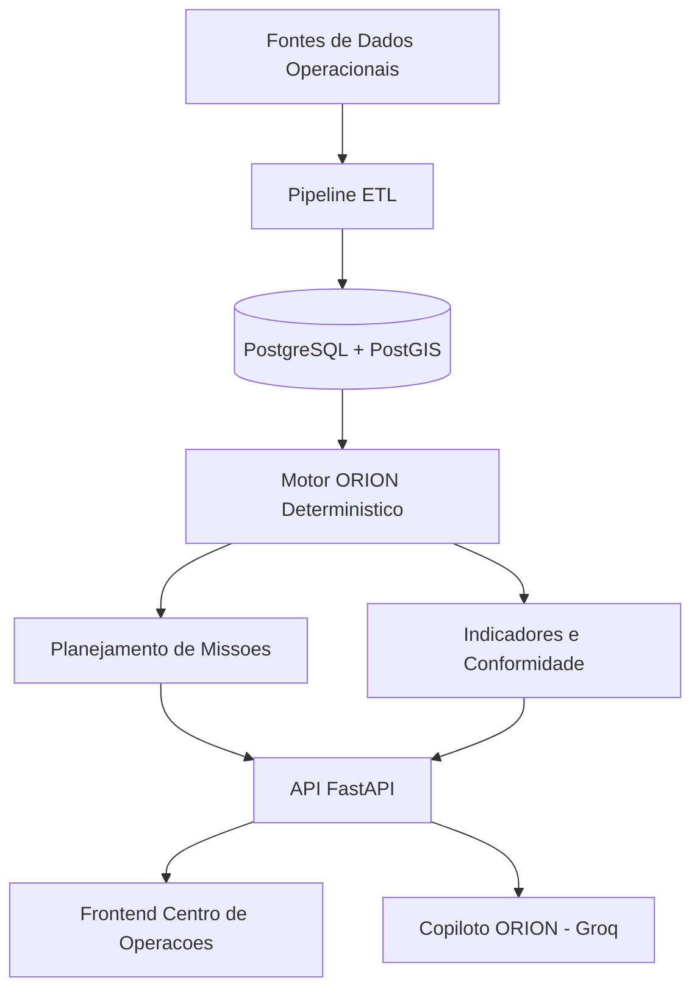
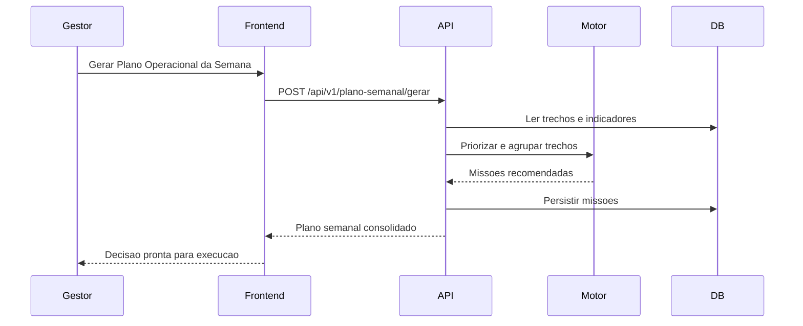
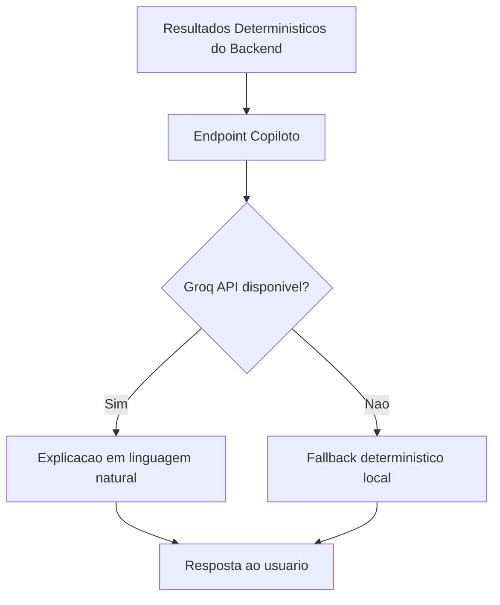

# Motiva ORION

Operational Roadside Intelligence & Optimization Network

Plataforma de inteligencia operacional para gestao preditiva da vegetacao rodoviaria.

Status: MVP operacional concluido (Sprints 1 a 5)  
Versao: 0.3.0  
Licenca: Proprietary (ajustar para a licenca oficial do projeto)  
Tecnologias principais: FastAPI, PostgreSQL/PostGIS, React, TypeScript, TailwindCSS, Leaflet

## Banner Inicial

**Motiva ORION** e um produto de apoio a decisao para operacoes rodoviarias. O sistema consolida dados operacionais, calcula risco deterministico, prioriza intervencoes e gera missoes executaveis para reduzir custo, risco e nao conformidade contratual.

## Problema de Negocio

A operacao tradicional de gestao de vegetacao em rodovias costuma ser reativa, com forte dependencia de inspeções manuais, planilhas isoladas e decisao descentralizada.

Principais dores operacionais:
- Priorizacao subjetiva de trechos sem score padronizado.
- Intervencoes tardias em trechos de alta criticidade.
- Deslocamento ineficiente de equipes e aumento de custo logistico.
- Baixa previsibilidade de risco contratual e operacional.
- Dificuldade de consolidacao executiva para auditoria e diretoria.

Impacto para a CCR Motiva:
- Maior custo por intervencao.
- Risco de nao conformidade contratual.
- Menor eficiencia no uso de equipes e recursos.
- Decisao operacional lenta em situacoes criticas.

## Solucao Proposta

O ORION transforma dados operacionais e geoespaciais em decisoes prontas para execucao.

O que o ORION entrega:
- Ingestao e normalizacao de dados de campo.
- Calculo deterministico do IRO (Indice de Risco Operacional).
- Priorizacao automatica de trechos.
- Planejamento automatico de missoes com custo e tempo estimados.
- Simulacao de cenarios com impacto de negocio.
- Relatorios executivos e operacionais em PDF.

Beneficios operacionais:
- Menor tempo para decidir onde atuar primeiro.
- Maior padronizacao tecnica entre operacao e gestao.
- Melhor alocacao de equipes por criticidade e proximidade.

Beneficios financeiros:
- Reducao de deslocamentos improdutivos.
- Reducao de custo corretivo por intervencao tardia.
- Maior previsibilidade de gasto semanal/mensal.

## Diferenciais

- **Motor ORION**: nucleo deterministico de decisao operacional, sem dependencia de IA para calculo critico.
- **IRO (0-100)**: score unificado para priorizacao objetiva entre trechos.
- **Planejamento Automatico**: converte analise em missoes praticas com equipe, custo e tempo.
- **Simulador de Cenarios**: compara estrategias (seguranca, economia, reducao de equipes, frequencia alta).
- **Conformidade Contratual**: monitora risco e exposicao de nao conformidade em visao executiva.
- **Copiloto Operacional**: traduz resultados do backend para linguagem executiva sem interferir nos calculos.

## Arquitetura Visual

### Arquitetura Geral



### Fluxo de Dados


### Fluxo Operacional



### Fluxo da IA



## Modelo de Dados

### Entidades Principais

- **Trecho**
  - `id`, `km_inicio`, `km_fim`, `sentido`, `lado`, `tipo_area`
  - `nivel_rocada`, `data_referencia`, `status`
  - `latitude`, `longitude`, `geom`
  - `dias_sem_manutencao`, `chuva_acumulada_mm`, `criticidade_operacional`, `risco_contratual`
  - `iro`, `classificacao`, `recomendacao_acao`, `recomendacao_prazo_dias`, `recomendacao_metodo`

- **Missao**
  - `id`, `codigo`, `prioridade`, `equipe`
  - `tempo_estimado_h`, `custo_estimado`, `economia_logistica_estimada`
  - `trecho_ids`, `plano_semanal_ref`, `created_at`

- **Indicador**
  - `id`, `data_referencia`
  - `total_trechos`, `trechos_criticos`, `indice_medio_iro`, `economia_potencial`

- **Intervencao**
  - `id`, `trecho_id`, `data_execucao`, `tipo_intervencao`, `custo`, `observacoes`

- **Usuario**
  - `id`, `nome`, `email`, `password_hash`, `perfil`, `ativo`

### Relacionamentos

- Um `Trecho` possui varias `Intervencoes`.
- Uma `Missao` referencia um conjunto de `Trechos` por `trecho_ids`.
- `Indicadores` agregam o estado geral dos `Trechos` e `Missoes`.

## Regras de Negocio

- **IRO**
  - Escala de 0 a 100.
  - Calculado por pesos configuraveis para: vegetacao, dias sem manutencao, chuva, criticidade operacional e risco contratual.

- **Criticidade**
  - `0-30`: Normal
  - `31-60`: Atencao
  - `61-100`: Critico

- **Geracao de Missoes**
  - Seleciona prioritariamente trechos de maior IRO.
  - Agrupa por proximidade operacional.
  - Estima equipe, tempo, custo e economia logistica.

- **Conformidade**
  - Indicador calculado pelo percentual de trechos com alta exposicao contratual e/ou classificacao critica.

## Casos de Uso

- **Gestor Operacional**
  - Define prioridades semanais e aprova plano de execucao.

- **Coordenador**
  - Organiza frentes de campo com base em missoes sugeridas.

- **Equipe de Campo**
  - Executa pacotes de missao com parametros claros de prazo e metodo.

- **Auditoria**
  - Consulta rastreabilidade operacional e relatorios de conformidade.

- **Diretoria**
  - Acompanha risco agregado, economia potencial e eficiencia operacional.

## Roadmap

### MVP Atual
- ETL operacional (CSV/XLSX/KML/KMZ).
- Motor ORION com IRO deterministico.
- Missao automatica e plano semanal.
- Centro de decisao com mapa, ranking, conformidade e relatrios.
- Copiloto explicativo integrado.

### Versao 2.0
- Integracao produtiva com Sentinel-2.
- Indicadores EVI/NDVI historicos.
- Enriquecimento com camadas geograficas externas.
- Regras avancadas de previsao de crescimento vegetativo.

### Versao 3.0
- Aplicativo movel para equipes de campo.
- Evidencia fotografica georreferenciada por intervencao.
- Digital Twin operacional avancado da malha rodoviaria.
- Orquestracao de operacao multi-regional.

## Seguranca

- JWT para autenticacao de sessao.
- Controle de acesso por perfil: `admin`, `gestor`, `coordenador`, `operador`.
- Senhas persistidas com hash (`bcrypt`).
- Endpoints criticos protegidos por autorizacao por papel.

## Observabilidade

- Middleware com `request_id` por requisicao.
- Logs estruturados de metodo, rota, status e latencia.
- Metricas Prometheus:
  - `orion_http_requests_total`
  - `orion_http_request_latency_seconds`
  - `orion_http_errors_total`
- Tratamento padrao para excecoes nao tratadas com retorno controlado.

## Estrutura de Desenvolvimento

O projeto segue separacao de responsabilidades com orientacao a dominio e camadas:

- `domain`: contratos e modelos de negocio.
- `application`: casos de uso e servicos de orquestracao.
- `engine`: regras deterministicas (IRO, priorizacao, recomendacao, missoes).
- `repositories`: acesso a dados.
- `api`: exposicao REST.
- `etl`: importacao e normalizacao de dados.
- `core`: configuracoes, auth e cross-cutting concerns.

Principios aplicados:
- Separation of Concerns.
- KISS.
- DRY.
- SOLID (com foco em servicos coesos e responsabilidades explicitas).

## Decisoes Arquiteturais (ADR Simplificado)

- **Por que FastAPI?**
  - Alto throughput, tipagem forte com Pydantic e baixa friccao para APIs operacionais.

- **Por que PostgreSQL?**
  - Robustez transacional e maturidade para workloads corporativos.

- **Por que PostGIS?**
  - Capacidade geoespacial nativa para analise e persistencia de geometria.

- **Por que Leaflet?**
  - Biblioteca leve e consolidada para mapa operacional web.

- **Por que Groq?**
  - Baixa latencia para camada explicativa, mantendo IA separada do nucleo de decisao.

## Screenshots

- 
- 
- 
- 

## Impacto Esperado

Metricas de negocio simuladas para orientacao executiva:
- Reducao de deslocamentos operacionais: 12% a 22%.
- Reducao de custo direto de operacao: 8% a 18%.
- Aumento da previsibilidade operacional: 20% a 35%.
- Melhoria da conformidade contratual: 10 a 25 pontos percentuais.

## Visao Geral
Motiva ORION (Operational Roadside Intelligence & Optimization Network) e uma plataforma de inteligencia operacional para gestao preditiva de vegetacao rodoviaria.

O foco do produto e decisao operacional: priorizar trechos, planejar missoes, controlar conformidade e reduzir custo com base em regras deterministicas no backend.

## Objetivo de Negocio
Responder de forma objetiva:
- Onde atuar primeiro.
- Quais trechos possuem maior risco operacional e contratual.
- Qual equipe deve ser alocada.
- Qual custo estimado da operacao.
- Qual impacto esperado em risco, conformidade e economia.

## Arquitetura
Dados
-> PostgreSQL + PostGIS
-> Motor ORION (deterministico)
-> Planejamento de Missoes
-> API REST
-> Interface de Centro de Operacoes

## Stack
### Frontend
- React
- TypeScript
- Vite
- TailwindCSS
- Leaflet

### Backend
- FastAPI
- SQLAlchemy
- PostgreSQL
- PostGIS

### ETL e Dados Geoespaciais
- Pandas
- GeoPandas
- OpenPyXL
- Shapely
- FastKML

### Integracoes
- Open-Meteo
- OpenStreetMap / Overpass / Nominatim
- OpenRouteService (preparado)
- Groq (camada explicativa; sem calculos de risco/prioridade)

## Estrutura de Pastas
```text
backend/
  app/
    api/
    application/
    core/
    database/
    domain/
    engine/
    etl/
    infrastructure/
    repositories/
  data/
    raw/
    processed/
    imports/
    exports/
  database/
    migrations/
  repositories/
  scripts/
frontend/
```

## Funcionalidades Implementadas
### 1. Data Foundation
- Importacao de arquivos CSV, XLSX, KML e KMZ.
- Pipeline ETL com normalizacao para modelo unico.
- Campos padronizados:
  - `km_inicio`
  - `km_fim`
  - `sentido`
  - `lado`
  - `tipo_area`
  - `nivel_rocada`
  - `data_referencia`
  - `status`

### 2. Motor ORION
- Calculo de IRO (0 a 100) no backend.
- Classificacao:
  - 0-30: Normal
  - 31-60: Atencao
  - 61-100: Critico
- Fatores:
  - nivel da vegetacao/rocada
  - dias sem manutencao
  - chuva acumulada
  - criticidade operacional
  - risco contratual
- Recomendacao automatica por trecho:
  - acao
  - prazo
  - metodo

### 3. Planejamento Operacional
- Mission Planning Engine para agrupar trechos prioritarios.
- Geracao de missoes com:
  - prioridade
  - equipe sugerida
  - tempo estimado
  - custo estimado
  - economia logistica
- Gerador de Plano Semanal com recomendacoes executivas.

### 4. Governanca e Seguranca
- Autenticacao JWT.
- Controle de acesso por perfil (`admin`, `gestor`, `coordenador`, `operador`).
- Login para frontend via endpoint JSON.
- Seed com usuarios padrao e senha com hash bcrypt.

### 5. Conformidade e Relatorios
- Painel de conformidade contratual.
- Relatorios PDF:
  - operacional
  - executivo
  - conformidade

### 6. Centro de Operacoes (Frontend)
- Painel executivo de decisao.
- Simulador de cenarios.
- Mapa operacional com status por criticidade.
- Ranking e detalhe de trecho.
- Planejador de missoes.
- Copiloto para explicacao textual e exportacao de relatorios.

## Endpoints Principais
Base: `http://127.0.0.1:8000`

- `GET /health`
- `POST /api/v1/auth/login`
- `POST /api/v1/auth/login-json`
- `GET /api/v1/auth/me`
- `POST /api/v1/bootstrap`
- `POST /api/v1/imports/gestao-verde`
- `GET /api/v1/trechos`
- `GET /api/v1/trechos/criticos`
- `GET /api/v1/trechos/{id}`
- `GET /api/v1/indicadores`
- `GET /api/v1/missoes`
- `POST /api/v1/plano-semanal/gerar`
- `GET /api/v1/conformidade`
- `GET /api/v1/dashboard`
- `POST /api/v1/copilot/perguntar`
- `GET /api/v1/relatorios/{tipo}`

## Regra de Governanca de IA
A IA nao calcula:
- IRO
- risco
- prioridade
- missoes

Todos os calculos operacionais sao deterministas e executados no backend. A IA apenas interpreta os resultados para linguagem natural.

## Inicializacao Rapida (Windows)
1. Execute `setup-local.cmd`
2. Execute `start-local.cmd`

## Execucao Manual
### Backend
```bash
cd backend
python -m venv .venv
.venv\Scripts\activate
pip install -r requirements.txt
.venv\Scripts\python.exe scripts\run_sql_migrations.py
.venv\Scripts\python.exe scripts\seed_db.py
uvicorn app.main:app --reload
```

### Frontend
```bash
cd frontend
npm install
npm run dev
```

## Credenciais Seed
- `admin@motiva-orion.local` / `orion123`
- `gestor@motiva-orion.local` / `orion123`
- `operador@motiva-orion.local` / `orion123`

Observacao de ambiente local:
- Nesta configuracao local, as contas podem operar sem `password_hash` persistido e usam `auth_default_password` definido no backend.

## Fluxo Recomendado de Uso
1. Colocar arquivos em `backend/data/raw`.
2. Executar `POST /api/v1/bootstrap`.
3. Consultar `GET /api/v1/dashboard` e `GET /api/v1/conformidade`.
4. Gerar plano semanal em `POST /api/v1/plano-semanal/gerar`.
5. Usar `POST /api/v1/copilot/perguntar` para explicacoes executivas.
6. Exportar relatorios PDF para stakeholders.

## Execucao por Sprints
- Plano macro: `docs/sprints/SPRINTS.md`
- Sprint 1: `docs/sprints/sprint-01-backlog.md`
- Status: Sprints 1 a 5 concluidas.

## Checklist de Validacao Operacional
- Backend: `pytest` sem falhas.
- Frontend: `npm run build` sem falhas.
- API: `GET /health` retorna `status: ok`.
- Banco: migrations SQL aplicadas via `scripts/run_sql_migrations.py`.
- Acesso: login com usuario seed e token JWT valido.
- Dados: carga via `POST /api/v1/bootstrap` ou `POST /api/v1/imports/gestao-verde`.
- Decisao: plano semanal gerado via `POST /api/v1/plano-semanal/gerar`.
- Relatorios: download PDF por `GET /api/v1/relatorios/{tipo}`.

## Limitacoes Atuais do MVP
- Integracoes satelitais (Sentinel/Copernicus) ainda nao habilitadas em producao.
- OpenRouteService mantido como preparacao arquitetural.
- Copiloto com Groq e fallback local; IA apenas explicativa por governanca.

## Conclusao Executiva
Motiva ORION foi estruturado para operar como plataforma de decisao operacional em infraestrutura rodoviaria, conectando dados, risco, conformidade e execucao em um unico fluxo corporativo.

O produto nao se limita a visualizacao de indicadores. O foco e transformar contexto operacional em acao priorizada, com rastreabilidade, governanca e impacto direto em custo, seguranca e eficiencia da operacao.


